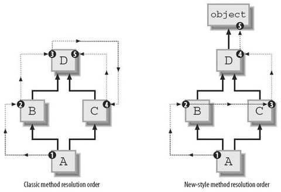

## Python类与面向对象编程

面向对象编程（**OOP**）是Python强大力量的源泉，同时python具有使用黑魔法的潜质，比如python中强大的内省机制，元类等等，python允许充分探索和修改行为。同时，尽量不要滥用Python的黑魔法，尤其在生产级别的代码中，使用黑魔法一定要谨慎，要做好异常处理，否则就坚决不适用黑魔法。如果用简洁的方式能达到目标，那就应该保持简单的方式，简洁换来可读性，可维护性，甚至能带来好的性能。

每个程序都有状态和行为，**编程范式**的差别在于怎么查看、组织和包装他们。如果包装意味着封装了状态和行为的对象，说明使用的就是OOP。其他语言试图强迫你用一种预先的模式和风格来编程，但Python在背后提供支持并允许你充分表达自己的设计选择。

##### 如何创建一个类
如果一个要描述一个具有行为和状态的事物，映射在编程语言中，那就是类，使用类可以非常方便的赋予类行为和属性--**封装**；同时可以产生有相似属性的新事物--**继承**；还可以对不同输入情况下，表现出响应行为--**多态**。

现在在Python中，可以使用class关键字来声明一个类：
```python
class SomeName(object):
	pass
```
这就是最简单的类，没有任何属性和行为，但是Python的机制，会让他自动继承某些特殊的方法，你看到object就明白了，在Python中这样的声明class SomeName(object)，表示声明一个类为SomeName，继承自父类object，同时Python支持多重继承。

看下面的程序和输出：
```python
class SomeName(object):
	pass

def main():
    print type(SomeName)
    print dir(SomeName)
    someinstance = SomeName()
    print type(someinstance)
    print dir(someinstance)

    # 枚举所有默认属性
    for i in dir(someinstance):
        print i + 'attr:    ' + str(getattr(someinstance, i))

if __name__ == '__main__':
    main()
```
执行结果如下：
```python
<type 'type'>
['__class__', '__delattr__', '__dict__', '__doc__', '__format__', '__getattribute__', '__hash__', '__init__', '__module__', '__new__', '__reduce__', '__reduce_ex__', '__repr__', '__setattr__', '__sizeof__', '__str__', '__subclasshook__', '__weakref__']
<class '__main__.SomeName'>
['__class__', '__delattr__', '__dict__', '__doc__', '__format__', '__getattribute__', '__hash__', '__init__', '__module__', '__new__', '__reduce__', '__reduce_ex__', '__repr__', '__setattr__', '__sizeof__', '__str__', '__subclasshook__', '__weakref__']
__class__attr:    <class '__main__.SomeName'>
__delattr__attr:    <method-wrapper '__delattr__' of SomeName object at 0x05C00FF0>
__dict__attr:    {}
__doc__attr:    None
__format__attr:    <built-in method __format__ of SomeName object at 0x05C00FF0>
__getattribute__attr:    <method-wrapper '__getattribute__' of SomeName object at 0x05C00FF0>
__hash__attr:    <method-wrapper '__hash__' of SomeName object at 0x05C00FF0>
__init__attr:    <method-wrapper '__init__' of SomeName object at 0x05C00FF0>
__module__attr:    __main__
__new__attr:    <built-in method __new__ of type object at 0x1E2296E0>
__reduce__attr:    <built-in method __reduce__ of SomeName object at 0x05C00FF0>
__reduce_ex__attr:    <built-in method __reduce_ex__ of SomeName object at 0x05C00FF0>
__repr__attr:    <method-wrapper '__repr__' of SomeName object at 0x05C00FF0>
__setattr__attr:    <method-wrapper '__setattr__' of SomeName object at 0x05C00FF0>
__sizeof__attr:    <built-in method __sizeof__ of SomeName object at 0x05C00FF0>
__str__attr:    <method-wrapper '__str__' of SomeName object at 0x05C00FF0>
__subclasshook__attr:    <built-in method __subclasshook__ of type object at 0x05BE65B8>
__weakref__attr:    None
```
对于类来说，类的类型就是**type**，内建type是object和其他新风格类甚至内建type的元类，也就是说从object和内建的type继承就能创建出新风格的类。你编写的类实际上从基类继承了同样的元类。还有一种指定父类的方式就是从模块的全局__metaclass__变量获得它的元类，一般不会显示使用元类的。

实例的类型就是类本身，同时属性与类一致，当然会存在类方法、属性和实例方法、属性。这些方法都是新风格的类自带的，为了方便使用，随后会简单介绍它们。

讲解更高级的内容之前，先说一个问题，你可能见到过下面这种表达方式去申明一个类，这种类称为旧风格的类：
```python
class SomeName:
	pass

def main():
    print type(SomeName)
    print dir(SomeName)
    someinstance = SomeName()
    print type(someinstance)
    print dir(someinstance)

    # 枚举所有默认属性
    for i in dir(someinstance):
        print i + 'attr:    ' + str(getattr(someinstance, i))

if __name__ == '__main__':
    main()
```
执行结果为：
```python
<type 'classobj'>
['__doc__', '__module__']
<type 'instance'>
['__doc__', '__module__']
__doc__attr:    None
__module__attr:    __main__
```
哇....东西好少，这就是旧风格的类，对于旧风格的类中我最不能理解的就是，所有类的实例它们的类型，竟然是**instance**。也就是说如果你要动态比较某对象是否是某个类的实例的话，只能使用isinstan方法来比较类型，在新风格，可以用对象的```__class__```来比较。

##### “新”与“旧”之争
如上述所示，使用默认方式构建类的话属于旧风格，使用继承自object的类属于新风格，旧风格其实快被淘汰了，在Python3中将不会使用旧风格，所以还是掌握新风格为主。

对于新旧类来说，它们的区别除了需要显示继承object外，还可以显示声明元类的类型来创建新风格类，这两种方法是等价的。也就是在每个模块的类定义开始的位置，加入下面的赋值：
```python
__metaclass__ = type
```
刚才提过，新风格的类的类型是**type**，内建的type是object和其他的新风格类甚至是内建的type的元类，同时对于自定义的类，实际上从基类继承了同样的元类。

对于新旧类，还有除了元类不同、类型不同、默认属性不同之外，还有就是mro（即method resolution order）不同，mro主要是用于在多继承时判断调用的属性的路径或者说是属于哪个类。对于旧风格的类，mro是属于深度优先搜索算法，随后到了python2.3，启用了新的算法C3算法，该算法满足了本地优先级、单调性，使用广度优先的方式查找调用属性。
>C3算法最早被提出是用于Lisp的，应用在Python中是为了解决原来基于深度优先搜索算法不满足本地优先级，和单调性的问题。
本地优先级：指声明时父类的顺序，比如C(A,B)，如果访问C类对象属性时，应该根据声明顺序，优先查找A类，然后再查找B类。
单调性：如果在C的解析顺序中，A排在B的前面，那么在C的所有子类里，也必须满足这个顺序。

下面是新旧类查找的图解：

也就是说，如果D是B、C的公共父类，然后D拥有一个方法foo，B没有覆盖沿用父类，C覆盖foo有自定义的行为，在旧类中，会深度遍历找到父类D的foo行为，而忽略掉C的覆盖行为，这违反了本地优先级。所以新式类中采用广度优先，优先找到覆盖父类的C的foo行为。

##### 类的构建
如果要提到类的构建，那么必须说明元类在其中的作用。在Python中，类同样也是一种对象。是的，没错，就是对象。只要你使用关键字class，Python解释器在执行的时候就会创建一个对象。这个对象（类）自身拥有创建对象（类实例）的能力，而这就是为什么它是一个类的原因。但是，它的本质仍然是一个对象，于是乎你可以对它做如下的操作：

1)   你可以将它赋值给一个变量；

2)   你可以拷贝它；

3)   你可以为它增加属性；

4)   你可以将它作为函数参数进行传递。
在Python中，当执行任何类声明时，Python会进行下类步骤：将类名作为一个字符串记住，设为n，并将这个类的基类部分存为一个元组，设为b。对类主体的执行，会将主体中所有被绑定的名字作为键放入到一个新的字典d中，每一个键都有它的对应值（比如，对于def f(self)这样的声明，d['f']对应到用def声明创建的函数对象）。现在可以使用元类type来创建一个类了，使用方法类似**tmp = type(n, b, d)**，这个构造了一个新的类，同时属于新风格，该方法也可以动态地创建一个类。

内建函数type吗？这个古老但强大的函数能够让你知道一个对象的类型是什么，就像这样：

```Python
>>> print type(1)
<type 'int'>
>>> print type("1")
<type 'str'>
>>> print type(ObjectCreator)
<type 'type'>
>>> print type(ObjectCreator())
<class '__main__.ObjectCreator'>
>>> print type(1)
<type 'int'>
>>> print type("1")
<type 'str'>
>>> print type(ObjectCreator)
<type 'type'>
>>> print type(ObjectCreator())
<class '__main__.ObjectCreator'>
```
这里，type有一种完全不同的能力，它也能动态的创建类。type可以接受一个类的描述作为参数，然后返回一个类。（我知道，根据传入参数的不同，同一个函数拥有两种完全不同的用法是一件很傻的事情，但这在Python中是为了保持向后兼容性）

type可以像这样工作：
```python
type(类名, 父类的元组（针对继承的情况，可以为空），包含属性的字典（名称和值）)
```
当然这是黑魔法，对于一个正常的类来说，可以通过__new__和__init__来控制类的行为，当然如果没有显示的定义这两个方法，会继承元类中的属性。同时先调用类的```__new__```方法，然后调用```__init__```方法。
- ```__new__```： 对象的创建，是一个静态方法，第一个参数是cls。cls表示该类，由python解释器产生并传入（已经通过元类构建成功，看如下测试代码），这个方法返回一个创建好的类对象，一般使用父类或者object的```__new__```方法创建并返回，在上层基本用来控制类的构成的，比如托管类、单例模式等。依照Python官方文档的说法，```__new__```方法主要是当你继承一些不可变的class时(比如int, str, tuple)， 提供给你一个自定义这些类的实例化过程的途径。还有就是实现自定义的metaclass。
- ```__init__```： 对象的初始化， 是一个实例方法，第一个参数是self。self是该类实例化的对象，是类的实例，也是由python解释器传入的。
以下是python对该属性和创建的测试代码：

```python
class SomeName(object):
    t = 0
    def __new__(cls, *args, **kwargs):
        print '-*'*24
        print cls
        print cls.__class__
        print dir(cls)
        print 'in __new__ !!!!'
        print '-*'*24
        return object.__new__(cls, *args, **kwargs)

    def __init__(self):
        print 'in __init__!!!!'

def main():
    print type(SomeName)
    print dir(SomeName)
    someinstance = SomeName()
    print type(someinstance)
    print dir(someinstance)

    print SomeName.__name__

if __name__ == '__main__':
    main()
```
输出结果如下：
```python
<type 'type'>
['__class__', '__delattr__', '__dict__', '__doc__', '__format__', '__getattribute__', '__hash__', '__init__', '__module__', '__new__', '__reduce__', '__reduce_ex__', '__repr__', '__setattr__', '__sizeof__', '__str__', '__subclasshook__', '__weakref__', 't']
-*-*-*-*-*-*-*-*-*-*-*-*-*-*-*-*-*-*-*-*-*-*-*-*
<class '__main__.SomeName'>
<type 'type'>
['__class__', '__delattr__', '__dict__', '__doc__', '__format__', '__getattribute__', '__hash__', '__init__', '__module__', '__new__', '__reduce__', '__reduce_ex__', '__repr__', '__setattr__', '__sizeof__', '__str__', '__subclasshook__', '__weakref__', 't']
in __new__ !!!!
-*-*-*-*-*-*-*-*-*-*-*-*-*-*-*-*-*-*-*-*-*-*-*-*
in __init__!!!!
<class '__main__.SomeName'>
['__class__', '__delattr__', '__dict__', '__doc__', '__format__', '__getattribute__', '__hash__', '__init__', '__module__', '__new__', '__reduce__', '__reduce_ex__', '__repr__', '__setattr__', '__sizeof__', '__str__', '__subclasshook__', '__weakref__', 't']
SomeName
```

##### 元类
>“元类就是深度的魔法，99%的用户应该根本不必为此操心。如果你想搞清楚究竟是否需要用到元类，那么你就不需要它。那些实际用到元类的人都非常清楚地知道他们需要做什么，而且根本不需要解释为什么要用元类。”  —— Python界的领袖 Tim Peters

你可以在写一个类的时候为其添加__metaclass__属性。

```Python
class Foo(object):
	__metaclass__ = something…
[…]
class Foo(object):
	__metaclass__ = something…
[…]
```
如果你这么做了，Python就会用元类来创建类Foo。小心点，这里面有些技巧。你首先写下class Foo(object)，但是类对象Foo还没有在内存中创建。Python会在类的定义中寻找__metaclass__属性，如果找到了，Python就会用它来创建类Foo，如果没有找到，就会用内建的type来创建这个类。把下面这段话反复读几次。当你写如下代码时 :

```Python
class Foo(Bar):
    pass
class Foo(Bar):
    pass
```
Python做了如下的操作：

Foo中有```__metaclass__```这个属性吗？如果是，Python会在内存中通过```__metaclass__```创建一个名字为Foo的类对象（我说的是类对象，请紧跟我的思路）。如果Python没有找到```__metaclass__```，它会继续在Bar（父类）中寻找```__metaclass__```属性，并尝试做和前面同样的操作。如果Python在任何父类中都找不到```__metaclass__```，它就会在模块层次中去寻找```__metaclass__```，并尝试做同样的操作。如果还是找不到```__metaclass__```,Python就会用内置的type来创建这个类对象。

现在的问题就是，你可以在```__metaclass__```中放置些什么代码呢？答案就是：可以创建一个类的东西。那么什么可以用来创建一个类呢？type，或者任何使用到type或者子类化type的东东都可以。


- 自定义元类

元类的主要目的就是为了当创建类时能够自动地改变类。通常，你会为API做这样的事情，你希望可以创建符合当前上下文的类。假想一个很傻的例子，你决定在你的模块里所有的类的属性都应该是大写形式。有好几种方法可以办到，但其中一种就是通过在模块级别设定```__metaclass__```。采用这种方法，这个模块中的所有类都会通过这个元类来创建，我们只需要告诉元类把所有的属性都改成大写形式就万事大吉了。

幸运的是，```__metaclass__```实际上可以被任意调用，它并不需要是一个正式的类（我知道，某些名字里带有‘class’的东西并不需要是一个class，画画图理解下，这很有帮助）。所以，我们这里就先以一个简单的函数作为例子开始。

```Python
# 元类会自动将你通常传给‘type’的参数作为自己的参数传入
def upper_attr(future_class_name, future_class_parents, future_class_attr):
    '''返回一个类对象，将属性都转为大写形式'''
    #  选择所有不以'__'开头的属性
    attrs = ((name, value) for name, value in future_class_attr.items() if not name.startswith('__'))
# 元类会自动将你通常传给‘type’的参数作为自己的参数传入
def upper_attr(future_class_name, future_class_parents, future_class_attr):
    '''返回一个类对象，将属性都转为大写形式'''
    #  选择所有不以'__'开头的属性
    attrs = ((name, value) for name, value in future_class_attr.items() if not name.startswith('__'))
	
    # 将它们转为大写形式
    uppercase_attr = dict((name.upper(), value) for name, value in attrs)

    # 通过'type'来做类对象的创建
    return type(future_class_name, future_class_parents, uppercase_attr)

__metaclass__ = upper_attr  #  这会作用到这个模块中的所有类

class Foo(object):
    # 我们也可以只在这里定义__metaclass__，这样就只会作用于这个类中
    bar = 'bip'
    # 将它们转为大写形式
    uppercase_attr = dict((name.upper(), value) for name, value in attrs)

    # 通过'type'来做类对象的创建
    return type(future_class_name, future_class_parents, uppercase_attr)

__metaclass__ = upper_attr  #  这会作用到这个模块中的所有类

class Foo(object):
    # 我们也可以只在这里定义__metaclass__，这样就只会作用于这个类中
    bar = 'bip'
print hasattr(Foo, 'bar')
# 输出: False
print hasattr(Foo, 'BAR')
# 输出:True

f = Foo()
print f.BAR
# 输出:'bip'

print hasattr(Foo, 'bar')
# 输出: False
print hasattr(Foo, 'BAR')
# 输出:True
 
f = Foo()
print f.BAR
# 输出:'bip'
```
现在让我们再做一次，这一次用一个真正的class来当做元类。

```Python
# 请记住，'type'实际上是一个类，就像'str'和'int'一样
# 所以，你可以从type继承
class UpperAttrMetaClass(type):
    # __new__ 是在__init__之前被调用的特殊方法
    # __new__是用来创建对象并返回之的方法
    # 而__init__只是用来将传入的参数初始化给对象
    # 你很少用到__new__，除非你希望能够控制对象的创建
    # 这里，创建的对象是类，我们希望能够自定义它，所以我们这里改写__new__
    # 如果你希望的话，你也可以在__init__中做些事情
    # 还有一些高级的用法会涉及到改写__call__特殊方法，但是我们这里不用
    def __new__(upperattr_metaclass, future_class_name, future_class_parents, future_class_attr):
        attrs = ((name, value) for name, value in future_class_attr.items() if not name.startswith('__'))
        uppercase_attr = dict((name.upper(), value) for name, value in attrs)
        return type(future_class_name, future_class_parents, uppercase_attr)
# 请记住，'type'实际上是一个类，就像'str'和'int'一样
# 所以，你可以从type继承
class UpperAttrMetaClass(type):
    # __new__ 是在__init__之前被调用的特殊方法
    # __new__是用来创建对象并返回之的方法
    # 而__init__只是用来将传入的参数初始化给对象
    # 你很少用到__new__，除非你希望能够控制对象的创建
    # 这里，创建的对象是类，我们希望能够自定义它，所以我们这里改写__new__
    # 如果你希望的话，你也可以在__init__中做些事情
    # 还有一些高级的用法会涉及到改写__call__特殊方法，但是我们这里不用
    def __new__(upperattr_metaclass, future_class_name, future_class_parents, future_class_attr):
        attrs = ((name, value) for name, value in future_class_attr.items() if not name.startswith('__'))
        uppercase_attr = dict((name.upper(), value) for name, value in attrs)
        return type(future_class_name, future_class_parents, uppercase_attr)
```
但是，这种方式其实不是OOP。我们直接调用了type，而且我们没有改写父类的__new__方法。现在让我们这样去处理:

```Python
class UpperAttrMetaclass(type):
    def __new__(upperattr_metaclass, future_class_name, future_class_parents, future_class_attr):
        attrs = ((name, value) for name, value in future_class_attr.items() if not name.startswith('__'))
        uppercase_attr = dict((name.upper(), value) for name, value in attrs)

        # 复用type.__new__方法
        # 这就是基本的OOP编程，没什么魔法
        return type.__new__(upperattr_metaclass, future_class_name, future_class_parents, uppercase_attr)
class UpperAttrMetaclass(type):
    def __new__(upperattr_metaclass, future_class_name, future_class_parents, future_class_attr):
        attrs = ((name, value) for name, value in future_class_attr.items() if not name.startswith('__'))
        uppercase_attr = dict((name.upper(), value) for name, value in attrs)
 
        # 复用type.__new__方法
        # 这就是基本的OOP编程，没什么魔法
        return type.__new__(upperattr_metaclass, future_class_name, future_class_parents, uppercase_attr)
```
你可能已经注意到了有个额外的参数upperattr_metaclass，这并没有什么特别的。类方法的第一个参数总是表示当前的实例，就像在普通的类方法中的self参数一样。当然了，为了清晰起见，这里的名字我起的比较长。但是就像self一样，所有的参数都有它们的传统名称。因此，在真实的产品代码中一个元类应该是像这样的：

```Python
class UpperAttrMetaclass(type):
    def __new__(cls, name, bases, dct):
        attrs = ((name, value) for name, value in dct.items() if not name.startswith('__')
        uppercase_attr  = dict((name.upper(), value) for name, value in attrs)
        return type.__new__(cls, name, bases, uppercase_attr)
class UpperAttrMetaclass(type):
    def __new__(cls, name, bases, dct):
        attrs = ((name, value) for name, value in dct.items() if not name.startswith('__')
        uppercase_attr  = dict((name.upper(), value) for name, value in attrs)
        return type.__new__(cls, name, bases, uppercase_attr)
```
如果使用super方法的话，我们还可以使它变得更清晰一些，这会缓解继承（是的，你可以拥有元类，从元类继承，从type继承）

```Python
class UpperAttrMetaclass(type):
    def __new__(cls, name, bases, dct):
        attrs = ((name, value) for name, value in dct.items() if not name.startswith('__'))
        uppercase_attr = dict((name.upper(), value) for name, value in attrs)
        return super(UpperAttrMetaclass, cls).__new__(cls, name, bases, uppercase_attr)
class UpperAttrMetaclass(type):
    def __new__(cls, name, bases, dct):
        attrs = ((name, value) for name, value in dct.items() if not name.startswith('__'))
        uppercase_attr = dict((name.upper(), value) for name, value in attrs)
        return super(UpperAttrMetaclass, cls).__new__(cls, name, bases, uppercase_attr)
```
就是这样，除此之外，关于元类真的没有别的可说的了。使用到元类的代码比较复杂，这背后的原因倒并不是因为元类本身，而是因为你通常会使用元类去做一些晦涩的事情，依赖于自省，控制继承等等。确实，用元类来搞些“黑暗魔法”是特别有用的，因而会搞出些复杂的东西来。但就元类本身而言，它们其实是很简单的：

1)   拦截类的创建

2)   修改类

3)   返回修改之后的类

- 为什么要用metaclass类而不是函数?

由于```__metaclass__```可以接受任何可调用的对象，那为何还要使用类呢，因为很显然使用类会更加复杂啊？这里有好几个原因：

1）  意图会更加清晰。当你读到UpperAttrMetaclass(type)时，你知道接下来要发生什么。

2） 你可以使用OOP编程。元类可以从元类中继承而来，改写父类的方法。元类甚至还可以使用元类。

3）  你可以把代码组织的更好。当你使用元类的时候肯定不会是像我上面举的这种简单场景，通常都是针对比较复杂的问题。将多个方法归总到一个类中会很有帮助，也会使得代码更容易阅读。

4） 你可以使用__new__, __init__以及__call__这样的特殊方法。它们能帮你处理不同的任务。就算通常你可以把所有的东西都在__new__里处理掉，有些人还是觉得用__init__更舒服些。

5） 哇哦，这东西的名字是metaclass，肯定非善类，我要小心！


- 究竟为什么要使用元类？

现在回到我们的大主题上来，究竟是为什么你会去使用这样一种容易出错且晦涩的特性？好吧，一般来说，你根本就用不上它：

“元类就是深度的魔法，99%的用户应该根本不必为此操心。如果你想搞清楚究竟是否需要用到元类，那么你就不需要它。那些实际用到元类的人都非常清楚地知道他们需要做什么，而且根本不需要解释为什么要用元类。”  —— Python界的领袖 Tim Peters

元类的主要用途是创建API。一个典型的例子是Django ORM。它允许你像这样定义：

```Python
class Person(models.Model):
    name = models.CharField(max_length=30)
    age = models.IntegerField()
class Person(models.Model):
    name = models.CharField(max_length=30)
    age = models.IntegerField()
```
但是如果你像这样做的话：

```Python
guy  = Person(name='bob', age='35')
print guy.age
guy  = Person(name='bob', age='35')
print guy.age
```
这并不会返回一个IntegerField对象，而是会返回一个int，甚至可以直接从数据库中取出数据。这是有可能的，因为models.Model定义了__metaclass__， 并且使用了一些魔法能够将你刚刚定义的简单的Person类转变成对数据库的一个复杂hook。Django框架将这些看起来很复杂的东西通过暴露出一个简单的使用元类的API将其化简，通过这个API重新创建代码，在背后完成真正的工作。

##### 类的封装特性
Python中类的成员函数、成员变量默认都是公开的(public)，
而且Python中没有类似public、private等关键词来修饰成员函数，成员变量。
在python中定义私有成员只需要在变量名或函数名前加上(两个下划线)，那么这个函数或变量就变成私有的了。
在内部，python使用一种name mangling技术，将```__membername```替换成```_classname__membername```，
所以你在外部使用原来的私有成员的名字时，会提示找不到。
Python的私有成员并不是真正意义上的私有，在类外部也可以调用。

```python
class Test(object):
    def __init__(self):
        super(Test, self).__init__();
        self.__message = 'hello world!'

    def __getMessage(self):
        print self.__message

if __name__ == '__main__':
    obj = Test()
    print dir(obj)
    print obj._Test__message
    obj._Test__getMessage()

['_Test__getMessage', '_Test__message', '__class__', '__delattr__', '__dict__',
'__doc__', '__format__', '__getattribute__', '__hash__', '__init__', '__module__
', '__new__', '__reduce__', '__reduce_ex__', '__repr__', '__setattr__', '__sizeo
f__', '__str__', '__subclasshook__', '__weakref__']
hello world!
hello world!
```
对于在类中直接定义的属性和方法被称为类属性和类方法，在init函数添加到self实例的被称为对象属性和方法，默认是公有的，可以通过加两个下划线开头编程私有的，具体原理如上。另外如果被staticmethod修饰器修饰的话，就是静态方法，该方法必须使用独立的作用域，不能使用self实例。
##### 类的常用默认方法及父类方法调用
 | 内置方法	| 说明 |
 | ------------- |:-------------:|
 | ```__init__(self,...)``` |	 初始化对象，在创建新对象时调用 |
 | ```__del__(self)```	  |  释放对象，在对象被删除之前调用 |
 | ```__new__(cls,*args,**kwd)``` |	 实例的生成操作 |
 | ```__str__(self)``` |	 在使用print语句时被调用 |
 | ```__getitem__(self,key)```　| 获取序列的索引key对应的值，等价于seq[key] |
 | ```__len__(self)``` |	 在调用内联函数len()时被调用 |
 | ```__cmp__(stc,dst)``` |	 比较两个对象src和dst |
 | ```__getattr__(s,name)``` |	 获取属性的值 |
 | ```__setattr__(s,name,value)``` |	 设置属性的值 |
 | ```__delattr__(s,name)``` |	 删除name属性 |
 | ```__getattribute__()``` |	 ```__getattribute__()```功能与```__getattr__()```类似 |
 | ```__gt__(self,other)``` |	 判断self对象是否大于other对象 |
 | ```__lt__(slef,other)``` |	 判断self对象是否小于other对象 |
 | ```__ge__(slef,other)``` |	 判断self对象是否大于或者等于other对象 |
 | ```__le__(slef,other)``` |	 判断self对象是否小于或者等于other对象 |
 | ```__eq__(slef,other)``` |	 判断self对象是否等于other对象 |
 | ```__call__(self,*args)``` |	 把实例对象作为函数调用 |
- ```__init__()```:
```__init__```方法在类的一个对象被建立时，马上运行。这个方法可以用来对你的对象做一些你希望的初始化。注意，这个名称的开始和结尾都是双下划线。
代码例子:

```python
#!/usr/bin/python
# Filename: class_init.py
class Person:
    def __init__(self, name):
        self.name = name
    def sayHi(self):
        print 'Hello, my name is', self.name
p = Person('Swaroop')
p.sayHi()

输出：
Hello, my name is Swaroop
```

   说明：```__init__```方法定义为取一个参数name（以及普通的参数self）。在这个```__init__```里，我们只是创建一个新的域，也称为name。注意它们是两个不同的变量，尽管它们有相同的名字。点号使我们能够区分它们。最重要的是，我们没有专门调用```__init__```方法，只是在创建一个类的新实例的时候，把参数包括在圆括号内跟在类名后面，从而传递给```__init__```方法。这是这种方法的重要之处。现在，我们能够在我们的方法中使用self.name域。这在sayHi方法中得到了验证。
- ```__new__()```:
```__new__()```在```__init__()```之前被调用，用于生成实例对象.利用这个方法和类属性的特性可以实现设计模式中的单例模式.单例模式是指创建唯一对象吗，单例模式设计的类只能实例化一个对象.

```python
#!/usr/bin/python
# -*- coding: UTF-8 -*-
class Singleton(object):
    __instance = None                       # 定义实例

    def __init__(self):
        pass

    def __new__(cls, *args, **kwd):         # 在__init__之前调用
        if Singleton.__instance is None:    # 生成唯一实例
            Singleton.__instance = object.__new__(cls, *args, **kwd)
        return Singleton.__instance
```

- ```__getattr__()```、```__setattr__()```和```__getattribute__()```:
当读取对象的某个属性时，python会自动调用```__getattr__()```方法.例如，fruit.color将转换为```fruit.__getattr__(color)```.当使用赋值语句对属性进行设置时，python会自动调用```__setattr__()```方法.```__getattribute__()```的功能与```__getattr__()```类似，用于获取属性的值.但是```__getattribute__()```能提供更好的控制，代码更健壮.注意，python中并不存在```__setattribute__()```方法.
代码例子：

```python
#!/usr/bin/python
# -*- coding: UTF-8 -*-
class Fruit(object):
    def __init__(self, color = "red", price = 0):
        self.__color = color
        self.__price = price
        
    def __getattribute__(self, name):               # 获取属性的方法
        return object.__getattribute__(self, name)

    def __setattr__(self, name, value):
        self.__dict__[name] = value

if __name__ == "__main__":
    fruit = Fruit("blue", 10)
    print fruit.__dict__.get("_Fruit__color")       # 获取color属性
    fruit.__dict__["_Fruit__price"] = 5
    print fruit.__dict__.get("_Fruit__price")       # 获取price属性

```

- ```__getitem__()```:
如果类把某个属性定义为序列，可以使用```__getitem__()```输出序列属性中的某个元素.假设水果店中销售多钟水果，可以通过```__getitem__()```方法获取水果店中的没种水果
代码例子:

```python
#!/usr/bin/python
# -*- coding: UTF-8 -*-
class FruitShop:
     def __getitem__(self, i):      # 获取水果店的水果
         return self.fruits[i]      

if __name__ == "__main__":
    shop = FruitShop()
    shop.fruits = ["apple", "banana"]
    print shop[1]
    for item in shop:               # 输出水果店的水果
        print item,

输出为:
banana
apple banana
```

- ```__str__()```:
```__str__()```用于表示对象代表的含义，返回一个字符串.实现了```__str__()```方法后，可以直接使用print语句输出对象，也可以通过函数str()触发```__str__()```的执行.这样就把对象和字符串关联起来，便于某些程序的实现，可以用这个字符串来表示某个类
代码例子：

```python
#!/usr/bin/python
# -*- coding: UTF-8 -*-
class Fruit:      
    '''Fruit类'''               #为Fruit类定义了文档字符串
    def __str__(self):          # 定义对象的字符串表示
        return self.__doc__

if __name__ == "__main__":
    fruit = Fruit()
    print str(fruit)            # 调用内置函数str()出发__str__()方法，输出结果为:Fruit类
    print fruit                 #直接输出对象fruit,返回__str__()方法的值，输出结果为:Fruit类

```
- ```__call__()```:
在类中实现```__call__()```方法，可以在对象创建时直接返回```__call__()```的内容.使用该方法可以模拟静态方法
代码例子:

```python
#!/usr/bin/python
# -*- coding: UTF-8 -*-
class Fruit:
    class Growth:        # 内部类
        def __call__(self):
            print "grow ..."

    grow = Growth()      # 调用Growth()，此时将类Growth作为函数返回,即为外部类Fruit定义方法grow(),grow()将执行__call__()内的代码
if __name__ == '__main__':
    fruit = Fruit()
    fruit.grow()         # 输出结果：grow ...
    Fruit.grow()         # 输出结果：grow ...
```
- 调用父类方法

python和其他面向对象语言类似，每个类可以拥有一个或者多个父类，它们从父类那里继承了属性和方法。如果一个方法在子类的实例中被调用，或者一个属性在子类的实例中被访问，但是该方法或属性在子类中并不存在，那么就会自动的去其父类中进行查找。继承父类后，就能调用父类方法和访问父类属性，而要完成整个集成过程，子类是需要调用的构造函数的。

在子类中，构造函数被重写，但新的构造方法没有任何关于初始化父类的namea属性的代码，为了达到预期的效果，子类的构造方法必须调用其父类的构造方法来进行基本的初始化。有两种方法能达到这个目的：调用超类构造方法的未绑定版本，或者使用super函数。

方法一：调用未绑定的超类构造方法

修改代码，多增一行：
```python
class A:
    def __init__(self):
        self.namea="aaa"
    def funca(self):
        print "function a : %s"%self.namea
class B(A):
    def __init__(self):
        #这一行解决了问题
        A.__init__(self)
        self.nameb="bbb"
    def funcb(self):
        print "function b : %s"%self.nameb
b=B()
print b.nameb
b.funcb()
b.funca()
```

如上有注释的一行解决了该问题，直接使用父类名称调用其构造函数即可。
这种方法叫做调用父类的未绑定的构造方法。在调用一个实例的方法时，该方法的self参数会被自动绑定到实例上（称为绑定方法）。但如果直接调用类的方法（比如A.__init），那么就没有实例会被绑定。这样就可以自由的提供需要的self参数，这种方法称为未绑定unbound方法。
通过将当前的实例作为self参数提供给未绑定方法，B类就能使用其父类构造方法的所有实现，从而namea变量被设置。

方法二：使用super函数

修改代码，这次需要增加在原来代码上增加2行：
```python
#父类需要继承object对象
class A(object):
    def __init__(self):
        self.namea="aaa"
    def funca(self):
        print "function a : %s"%self.namea
class B(A):
    def __init__(self):
        #这一行解决问题
        super(B,self).__init__()
        self.nameb="bbb"
    def funcb(self):
        print "function b : %s"%self.nameb
b=B()
print b.nameb
b.funcb()
b.funca()
```

如上有注释的为新增的代码，其中第一句让类A继承自object类，这样才能使用super函数，因为这是python的“新式类”支持的特性。当前的雷和对象可以作为super函数的参数使用，调用函数返回的对象的任何方法都是调用超类的方法，而不是当前类的方法。

super函数会返回一个super对象，这个对象负责进行方法解析，解析过程其会自动查找所有的父类以及父类的父类。
>需要注意的是，在一般的方法中，使用super(A, self)即获取超类，但是在```__new__```方法中，需要调用super(A, cls)才可。

方法一更直观，方法二可以一次初始化所有超类。

super函数比在超累中直接调用未绑定方法更直观，但是其最大的有点是如果子类继承了多个父类，它只需要使用一次super函数就可以。然而如果没有这个需求，直接使用A.__init__(self)更直观一些。

##### 类的常用修饰器
- classmethod：类方法和staticmethod：静态方法

在Python中，静态方法和类方法都是可以通过类对象和类对象实例访问。但是区别是：

@classmethod 是一个函数修饰符，它表示接下来的是一个类方法，而对于平常我们见到的则叫做实例方法。 类方法的第一个参数cls，而实例方法的第一个参数是self，表示该类的一个实例。
普通对象方法至少需要一个self参数，代表类对象实例
类方法有类变量cls传入，从而可以用cls做一些相关的处理。并且有子类继承时，调用该类方法时，传入的类变量cls是子类，而非父类。 对于类方法，可以通过类来调用，就像C.f()，有点类似C＋＋中的静态方法, 也可以通过类的一个实例来调用，就像C().f()，这里C()，写成这样之后它就是类的一个实例了。
静态方法则没有，它基本上跟一个全局函数相同，一般来说用的很少。

- property修饰器

Python中有一个被称为属性函数(property)的小概念，它可以做一些有用的事情。它可以让python中类的方法变为属性，可以直接访问。在这篇文章中，我们将看到如何能做以下几点：

1） 将类方法转换为只读属性

2）重新实现一个属性的setter和getter方法

在本文中，您将学习如何以几种不同的方式来使用内置的属性函数。希望读到文章的末尾时，你能看到它是多么有用。
使用属性函数的最简单的方法之一是将它作为一个方法的装饰器来使用。这可以让你将一个类方法转变成一个类属性。当我需要做某些值的合并时，我发现这很有用。其他想要获取它作为方法使用的人，发现在写转换函数时它很有用。让我们来看一个简单的例子：

```python

```

```python
class Person(object):
    """"""
 
    #----------------------------------------------------------------------
    def __init__(self, first_name, last_name):
        """Constructor"""
        self.first_name = first_name
        self.last_name = last_name
 
    #----------------------------------------------------------------------
    @property
    def full_name(self):
        """
        Return the full name
        """
        return "%s %s" % (self.first_name, self.last_name)
```
在上面的代码中，我们创建了两个类属性：self.first_name和self.last_name。接下来，我们创建了一个full_name方法，它有一个@property装饰器。这使我们能够在Python解释器会话中有如下的交互：

```python
>>> person = Person("Mike", "Driscoll")
>>> person.full_name
'Mike Driscoll'
>>> person.first_name
'Mike'
>>> person.full_name = "Jackalope"
Traceback (most recent call last):
  File "<string>", line 1, in <fragment>
AttributeError: can't set attribute
```
正如你所看到的，因为我们将方法变成了属性，我们可以使用正常的点符号访问它。但是，如果我们试图将该属性设为其他值，我们会引发一个AttributeError错误。改变full_name属性的唯一方法是间接这样做：

```python
>>> person.first_name = "Dan"
>>> person.full_name
'Dan Driscoll'
```
这是一种限制，因此让我们来看看另一个例子，其中我们可以创建一个允许设置的属性。

使用Python property取代setter和getter方法

```python
from decimal import Decimal
 
########################################################################
class Fees(object):
    """"""
 
    #----------------------------------------------------------------------
    def __init__(self):
        """Constructor"""
        self._fee = None
 
    #----------------------------------------------------------------------
    @property
    def fee(self):
        """
        The fee property - the getter
        """
        return self._fee
 
    #----------------------------------------------------------------------
    @fee.setter
    def fee(self, value):
        """
        The setter of the fee property
        """
        if isinstance(value, str):
            self._fee = Decimal(value)
        elif isinstance(value, Decimal):
            self._fee = value
 
#----------------------------------------------------------------------
if __name__ == "__main__":
    f = Fees()
```
上面的代码演示了如何为fee属性创建一个setter方法。你可以用一个名为@fee.setter的装饰器装饰第二个方法名也为fee的方法来实现这个。当你如下所做时，setter被调用。如果你看属性函数的说明，它有fget, fset, fdel和doc几个参数。如果你想对属性使用del命令，你可以使用@fee.deleter创建另一个装饰器来装饰相同名字的函数从而实现删除的同样效果。
