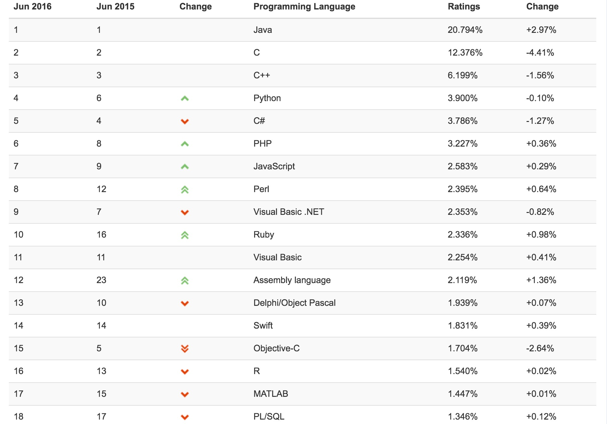
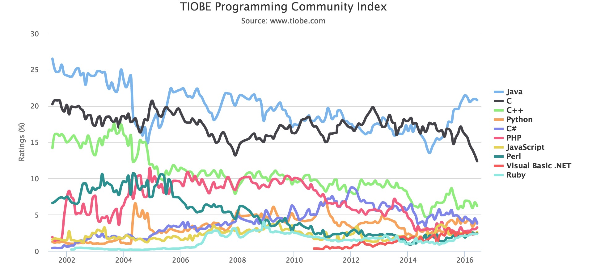
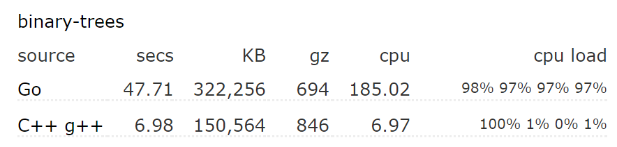
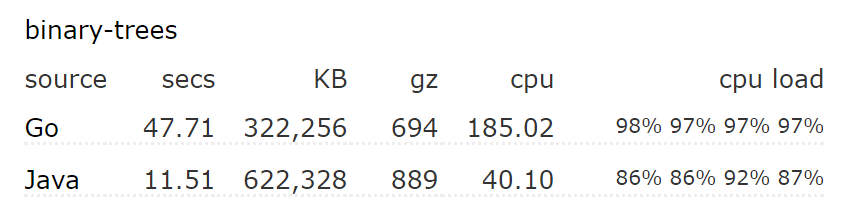
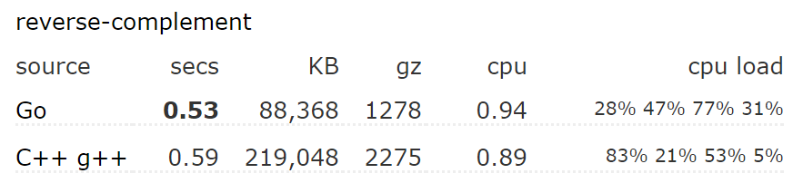
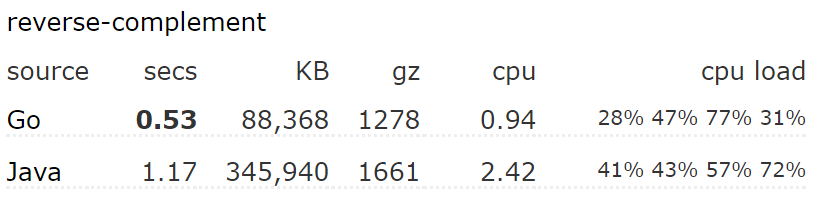
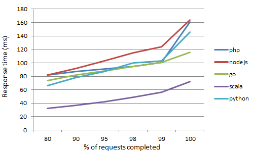

#编程语言之争
---
最近我自己学习了一门新的语言，当然，大家对于编程语言的选择，存在各种各样的考虑，应用是否广泛，是否有很多的现有库，更多是来自从上到下的传递，我也在这方面有所感触，所以这次做了一个小的总结，来说明编程语言的近几年变化，最后讲了我最近在学的动态语言的优势，及Python的黑魔法。

当前对于软件开发来说，我们可以选择的语言不想几十年前那样，只有略略几种，并且由于硬件的瓶颈，当时要求编程语言是高效的，低内存消耗、更快的时间。如今程序员已经是一种广泛的职业，不再是高门槛的学科，由近代流行的软件工程思想而言，更严谨的开发流程，更可控的软件风险，更具象的软件设计是关键，并且当前的软件开发，大多都在高效率和高性能之间进行权衡，来选择不同的技术栈来完成自己的设计；并且往往高性能是由硬件弥补的情况下，高开发效率是选择的关键。

####一、编程语言的流行趋势

>TIOBE排行榜是根据互联网上有经验的程序员、课程和第三方厂商的数量，并使用搜索引擎（如Google、Bing、Yahoo!）以及Wikipedia、Amazon、YouTube统计出排名数据，只是反映某个编程语言的热门程度，并不能说明一门编程语言好不好，或者一门语言所编写的代码数量多少。
该指数可以用来检阅开发者的编程技能能否跟上趋势，或是否有必要作出战略改变，以及什么编程语言是应该及时掌握的。观察认为，该指数反应的虽并非当前最流行或应用最广的语言，但对世界范围内开发语言的走势仍具有重要参考意义。

在2016年6月，在TIOBE指数语言历史上第一次前20部分都超过1%。这表明，真正的市场领导者的数量正在下降。从中选择了一组语言，发现少量应用的编程语言有时也被采纳。大约10年前，前8语言覆盖了80%的市场，现在这是减少到 55%。这种现象也是编程语言的长尾效应。




上述，对当前编程语言有了一个宏观的了解，我认为在当前计算机技术飞速进步的时代，面临越来越多的选择，面对繁多的技术体系，这让我想起来了机器学习里的NFL定理。

>NFL定理，在所有问题出现的机会相等、或所有问题都是同等重要时，所有算法的结果都一样好。这个有一个复杂的证明，感兴趣的同学可以看看。而实际情形往往并不是这样。一般我们只需要关注自己正要解决的问题即可。而对于我们的解决方案在另一个问题上的表现是否同等出色，我们并不关心。

由彼推己，在编程语言中，一项应用可以通过各种语言实现，但是最终什么才是最适合的，最佳的选择，往往在于特定问题，或者在实现难度、自己的技能熟练度、性能等做出折中。而不是空谈什么语言是最好的。

####二、编程语言的种类
从历史角度来说，编程语言分为：第一代语言(机器语言)、第二代语言(汇编语言)、第三代语言(高级语言)；而高级语言中，以执行方式又分为：编译型语言和解释型语言，从语言的编程范式可分为：过程式，面向对象式，函数式，逻辑式。下面主要说明流行的语言及所属类别。

#####编译型语言

>编译型语言：程序在执行之前需要一个专门的编译过程，把程序编译成 为机器语言的文件，运行时不需要重新翻译，直接使用编译的结果就行了。程序执行效率高，依赖编译器，跨平台性差些。

编译型语言的代表是```c/c++```和java，这三种语言占领了半壁江山。其中java比较特殊，使用了一种“一次编译，到处运行”的技术，通过java编译器吧源代码编译为中间字节码，随后在与操作系统无关的JVM（java虚拟机）中执行。这种技术导致了J2ME和J2SE技术的流行，为java带来了丰富的生态系统，拥有众多商业用户，并延伸到当前的J2EE和Android中，成为当前优先选择的编程语言之一。

相对Java而言，```c/c++```更注重性能，通常其是高性能的代名词，但是c的低开发效率和```c++```的复杂特性，让大多编程人员望而却步，同时培养成本更高。

但最近让人兴奋的是，人们尝试在并行编程和高性能的中间件中，尝试使用java、scala、go等语言做尝试，他们的性能有时并不逊于c++代码，也就是说现在人们拥有了更强大的编程工具来完成高性能的部分，java和scala得益于高度优化的JVM虚拟机，而go来自于良好的设计和编译器。
目前阿里的大数据的高性能中间件基本是由java编写的，当然还有Hadoop；当前流行的大数据处理框架Spark是由scala编写的，拥有客观的性能；对于Go语言现在流行的容器技术Docker是最成功的案例之一。

下面是Go和java、```c++```的性能对比（数据来自于benchmarksgame.alioth.debian.org）：





#####函数式编程
>函数式编程是种编程范式，它将电脑运算视为函数的计算。函数编程语言最重要的基础是 λ 演算（lambda calculus）。而且λ演算的函数可以接受函数当作输入（参数）和输出（返回值）。和指令式编程相比，函数式编程强调函数的计算比指令的执行重要。和过程化编程相比，函数式编程里，函数的计算可随时调用。
函数式编程中最古老的例子莫过于1958年被创造出来的LISP了，透过 LISP，可以用精简的人力。较现代的例子包括Haskell、Clean、Erlang和Miranda等。

函数式编程有以下特点：

1. 代码简洁，开发快速
函数式编程大量使用函数，减少了代码的重复，因此程序比较短，开发速度较快。

2. 接近自然语言，易于理解
函数式编程的自由度很高，可以写出很接近自然语言的代码。
将表达式(1 + 2) * 3 - 4，写成函数式语言：```subtract(multiply(add(1,2), 3), 4)```对它进行变形，不难得到另一种写法：```add(1,2).multiply(3).subtract(4)```这基本就是自然语言的表达了。

3. 更方便的代码管理
函数式编程不依赖、也不会改变外界的状态，只要给定输入参数，返回的结果必定相同。因此，每一个函数都可以被看做独立单元，很有利于进行单元测试（unit testing）和除错（debugging），以及模块化组合。

4. 易于"并发编程"
函数式编程不需要考虑"死锁"（deadlock），因为它不修改变量，所以根本不存在"锁"线程的问题。不必担心一个线程的数据，被另一个线程修改，所以可以很放心地把工作分摊到多个线程，部署"并发编程"（concurrency）。

当前，函数式编程是未来趋势之一，值得一提是，为了迎合这一趋势，目前最当红的Python、Ruby、Javascript，对函数式编程的支持都很强，就连老牌的面向对象的Java、面向过程的PHP，都忙不迭地加入对匿名函数的支持。越来越多的迹象表明，函数式编程已经不再是学术界的最爱，开始大踏步地在业界投入实用。

#####动态类型语言
>动态语言，是指程序在运行时可以改变其结构：新的函数可以被引进，已有的函数可以被删除等在结构上的变化。比如众所周知的ECMAScript(JavaScript)便是一个动态语言。除此之外如Ruby、Python等也都属于动态语言，而C、C++等语言则不属于动态语言。
所谓的动态类型语言，意思就是类型的检查是在运行时做的，也就是说代码是不是合法的要到运行时才判断（注意是运行时的类型判断）。

在动态类型中有一种重要的风格，称之为鸭子类型（duck typing）。可以这样表述：“当看到一只鸟走起来像鸭子、游泳起来像鸭子、叫起来也像鸭子，那么这只鸟就可以被称为鸭子。”

在鸭子类型中，关注的不是对象的类型本身，而是它是如何使用的。例如，在不使用鸭子类型的语言中，我们可以编写一个函数，它接受一个类型为鸭的对象，并调用它的走和叫方法。在使用鸭子类型的语言中，这样的一个函数可以接受一个任意类型的对象，并调用它的走和叫方法。如果这些需要被调用的方法不存在，那么将引发一个运行时错误。任何拥有这样的正确的走和叫方法的对象都可被函数接受的这种行为引出了以上表述，这种决定类型的方式因此得名。当然鸭子类型，只存在动态语言中，因为你不能通过类型来决定鸭子，你可以通过属性来使用它。

动态语言正变得越来越流行，势头最猛的莫过于javascript、python和ruby了，javascript现在以称霸浏览器和客户端，Google的V8引擎帮助javascript的执行速度直逼c++和java。js最大的特点就是异步性，给js带来巨大的性能提升，同时由于V8引擎的高可用性和高性能，目前js已经被用作更通用的开发环境中--也就是现在的Nodejs平台，提供了基于V8的js开发框架和库管理工具，让开发者可以用js写web应用、桌面应用、嵌入式开发等等，js正在称霸世界。

如果要说历史，python是一个老牌语言了，出现得很早，同时进步也很快，python很早之前已经是linux的标配。python在设计和指导人们开发时，注重简洁性，这就是python之禅（zen of python），即用一种方法，最好是只有一种方法来做一件事情。python现已应用于各种编程领域，在国内python基本等价于爬虫和机器学习，python易学易用，但python性能一般，c++/java通常是性能上的6-100倍左右，不过这是由于python的解释器没有高度优化的原因，现在python新的解释器，甚至是JIT技术正在发展。目前python广泛应用于数据领域、运维、web开发等。

Ruby在这两种之间有些特殊，因为它的流行源于一种框架，当然它的语言设计也很优越。这个框架就是著名的Ruby on Rails（ROR），对该框架最推崇的就是推特公司，现在该框架在国外的流行度非常高，很多初创企业都选择ROR作为自己的技术实现，Ruby也正被越来越多人熟知和使用。当然性能问题也是我们关注的，如下图是一个简单的对比（来自Skimlinks项目团队）。


####三、影响编程语言的关键
#####语言的语法和性能
该方面主要是语言设计者的偏好，下面给出python，c，c++，java，nodejs的“hello world！”代码：
```python
print('hello world!')
```
```C
#include <stdio.h>
int main(){
	printf("hello world!\r\n");
	return 0;
}
```
```c++
#include <iostream>
using namespace std;
int main(){
	cout<<"hello world!"<<endl;
	return 0;
}
```
```java
public class HelloWrold{
	public tatic void main(String[] args){
		System.out.println("hello world!");
	}
}
```
```javascript
console.log("hello world!\r\n");
```
可以发现，python和js的代码更简洁，也许一个不懂编程的也知道你的代码的含义。幸好，上述这些语言他们的设计都源于C语言，当你进一步认识的时候你会发现它们的循环控制、变量赋值、条件判断等等基础语法惊人的相似，我们可以统称他们为c家族，当然影响关系是这样传递的，c->```C++```->java->javascript，c->python。所以在上述编程语言间转换的话，掌握基本语法不会花费你太长时间。

对于python和js来说，好的程序员和坏的程序员之间实现的功能在性能上不会出现大的偏差，而对于c++等语言来说，可以通过不断重构代码，提升代码的性能，不过随之而来的就是庞大的代码量和较大的维护难度。

#####开源社区和商业支持
一种语言是否可以良性发展，除了人们是否在使用外，更重要的是开源社区的支持或者商业支持，比如说java的成功很大一部分源自JVM的性能提升，这里面有很多著名的程序员为其添砖加瓦，同时java已经成为当前类库最丰富的语言之一，这基本来自热爱开源的人们的无私奉献，同时java和.net一样，有强大的商业支持，分别是甲骨文和微软，只要这两大巨头不倒，就会为java和.net提供有力的支持，包括bug修复和版本更新等。

python也是一个很好的例子，python社区非常活跃，作为一门出身就自带开源光环的语言，python的类库相当丰富，从机器学习、数据处理、数据可视化、web开发、GUI编程、软件测试等等，都有大型的、高性能、得到社区认可的库，目前python社区十分稳定，尤其是最近加紧对python解释器的性能优化，相信python在未来也不会落后于他人。

####四、总结

最后总结一下，对于如何选择编程语言，也许你心理还没底，不过对于公司或者团队有稳定的项目代码的话，那么维护现有代码肯定是对的选择，可以继续学习该语言及其框架，如果需要大的更新或者代码需要重构是可以选择你认为高效率并有效的语言和框架。

至于性能方面的问题，如果为了提高性能可以选择可扩展性强的语言，比如c/c++/java，这些语言可以充分发挥你的才能，你可以创造出超乎想象的快的程序，当然c语言无论从经验还是实际中，用它实现的东西往往是最快的。

可维护性方面，往往是动态语言更有优势，他们具有更少的代码，更清晰的结构，套路也很少。

