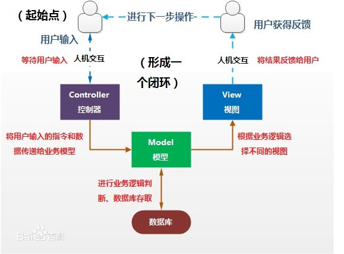

#网站开发基本模型
当前，由于对于响应式web的需求，日益增加，同时网页的功能逐渐复杂，前端正在变得越来越重要，当前网站开发模式，也在向这个趋势靠拢。webAPP已经成为趋势，API形式的数据服务也是网站开发越来越明显的道路。

#####MVC架构
我们都知道软件设计有一个著名的架构思维就是MVC架构，基本就是实现控制、视图和数据读取的解耦，来实现软件的复用。在java中最流行的就是SSH，不过当前Spring大行其道，JPA规范也完善了java的ORM模型，在python中，主流的是Django、flask、tornado等框架，由于python的灵活性，出现了比java更多的技术栈。


#####传统网站逻辑的设计
对于传统网站来说，后端就是主宰，web服务器承担了文件响应、超文本传输，后端一般使用模板语言渲染视图，代码和视图联系紧密，这样的好处是容易修改功能，有很高一致性。

缺点就是，增加后端负担，传输大量文本，另外一个问题是模板文件由谁来编写？后端知道类的属性和操作方法，前端负责写界面和响应，必须了解需要渲染的数据。


#####基于Restful API的网站逻辑设计
如今，用户对于响应式web（适应多屏幕，可动态响应）的更加渴望，前端也正在担任越来越重要的角色，WebAPP也是对于前端网页的新称呼，也就是说他们大部分行为是自行渲染界面，响应用户请求，而与服务器只进行少量的数据交互。

Restful API是一种API接口的规范，正式在这种趋势下诞生的。在这种网站设计逻辑下，前端渲染视图，所有前端和样式、js代码可以通过cdn（内容分发系统）来传输，减小服务器和web程序负担，提高响应率。
>REST 从资源的角度来观察整个网络，分布在各处的资源由URI确定，而客户端的应用通过URI来获取资源的表示方式。获得这些表徵致使这些应用程序转变了其状态。随着不断获取资源的表示方式，客户端应用不断地在转变着其状态，所谓表述性状态转移（Representational State Transfer）。
也就是说资源是由URI来指定。对资源的操作包括获取、创建、修改和删除资源，这些操作正好对应HTTP协议提供的GET、POST、PUT和DELETE方法。

下面给一些简单例子：
```python
GET /zoos：列出所有动物园
POST /zoos：新建一个动物园
GET /zoos/ID：获取某个指定动物园的信息
PUT /zoos/ID：更新某个指定动物园的信息（提供该动物园的全部信息）
PATCH /zoos/ID：更新某个指定动物园的信息（提供该动物园的部分信息）
DELETE /zoos/ID：删除某个动物园
GET /zoos/ID/animals：列出某个指定动物园的所有动物
DELETE /zoos/ID/animals/ID：删除某个指定动物园的指定动物
```


#####基于CMS系统的网站设计
>CMS是Content Management System的缩写，意为"内容管理系统"。主要以后台业务子系统管理、Portal系统和前台发布系统组成。

比较著名的就是wordpress，基于wordpress可以做博客、企业网站、新闻等等，只需要模板就够了。在python中django-cms很强大。

#####对于高访问量的服务器部署
主要是负载均衡。利用一个节点进行调度，其他节点处理。
