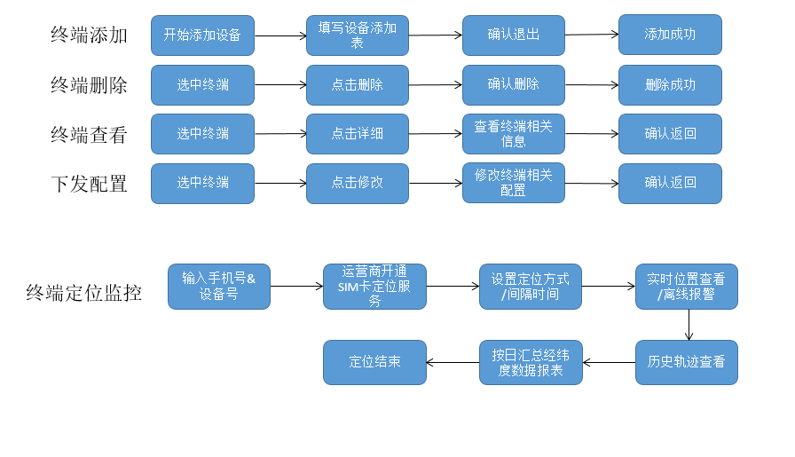
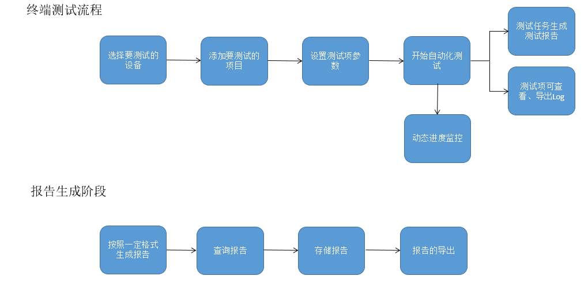
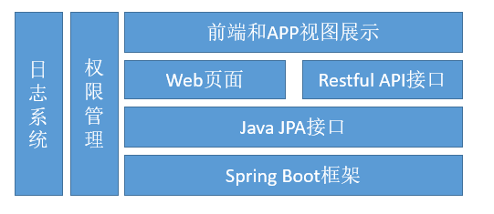
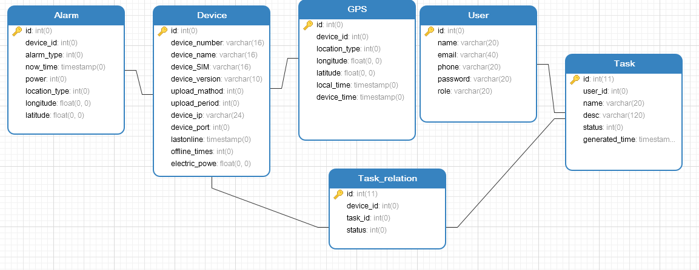

#摔倒设备Web管理平台

#####项目需求
本项目旨在完成对物联网的终端硬件的管理平台，现在设计完成大模块：
- 监控与管理模块
- 地图轨迹模块
- 设备批量测试模块

其中测试模块是新提出的需求，对于终端信息的收集统计，最后数据可视化。
* 下图是终端管理流程设计。

* 下图是测试模块设计。

目前，项目正在完成监控和管理模块，正在和终端设备联调。

#####项目框架
>当前后台系统开发，更趋向于微服务的形式，我们采用了基于微服务的spring boot。
>一个微服务一般完成某个特定的功能，比如下单管理、客户管理等等。每一个微服务都是微型六角形应用，都有自己的业务逻辑和适配器。一些微服务还会发布API给其它微服务和应用客户端使用。其它微服务完成一个Web UI，运行时，每一个实例可能是一个云VM或者是Docker容器。

#####数据库设计
因为在随后测试功能中，有允许多个用户测试功能的需求，所以需要设置用户和角色表来管理用户权限。数据库设计，使用navicat进行。主要是考虑表间的关系和表的属性，以及结构的拆分。

#####项目部署
目前项目部署，比较简单，直接运行.jar文件跑在后端，没有使用反向文件代理服务器优化功能，对于web部署可以随后专门讲一下。
